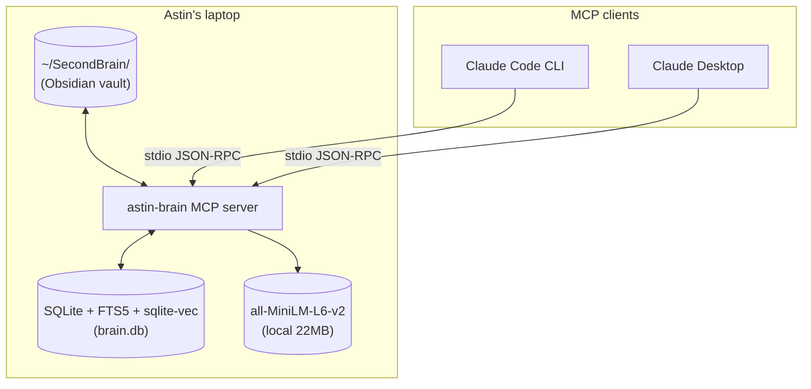
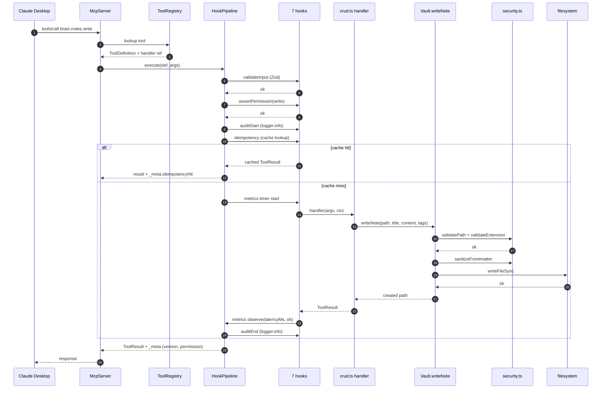
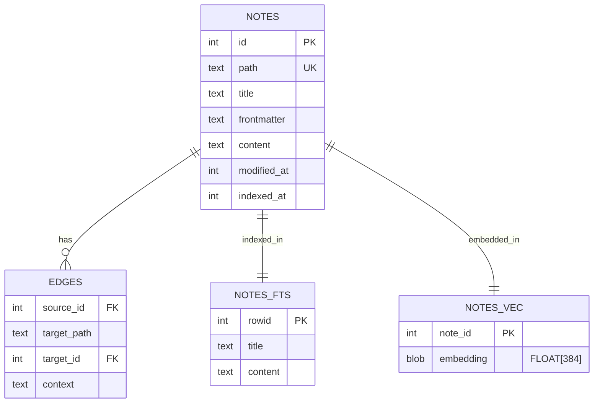

# Architecture — astin-brain

This document covers the **why** behind the design: the trade-offs taken,
the boundaries chosen, and the things this server intentionally does NOT do.

---

## 1. C4-style context



Everything is one process. No remote services, no network calls, no
secret management. The vault is files on disk. The DB is one file
(`.mcp-server/data/brain.db`). The model is a tarball in `node_modules/`.

This is intentional — the design pivots on locality. Adding a network
boundary (e.g. exposing the server over SSE) is a separate decision
documented in [§6](#6-what-id-change-for-production).

---

## 2. Sequence: `brain.notes.write` end-to-end



---

## 3. Why these trade-offs

### Why SQLite + sqlite-vec instead of a vector DB

- One file (`brain.db`) — git-ignorable, backup is `cp`, no daemon.
- FTS5 and `vec0` virtual tables live in the same DB, so BM25 and KNN happen with no IPC.
- 10k-note vault stays comfortably under 50MB and queries in <10ms.
- The minute the vault grows beyond ~100k notes or needs multi-user access, swap to Postgres + pgvector. The schema migrates with two `INSERT … SELECT` statements.

### Why graphology instead of Neo4j

- Personal vault is <10k nodes. BFS on an in-memory `DirectedGraph` runs in microseconds.
- Neo4j adds a JVM, network hop, and Cypher syntax — for what would otherwise be a 30-line BFS.
- The graph is rebuilt from SQLite edges on boot (O(edges)). Cheap.
- A larger vault would warrant a real graph DB; the interface in `graph-engine.ts` is small enough to swap.

### Why `all-MiniLM-L6-v2` (Xenova) instead of OpenAI / Cohere embeddings

- 22MB one-time download, no API key, no rate limit, no cost.
- 384 dims — enough quality for personal-scale retrieval (matches BERT-base).
- Multilingual (Spanish + English appear in this vault), critical for the use case.
- CPU inference at ~30ms per query on M1.
- Quality ceiling is the obvious downside. If retrieval precision becomes the bottleneck, the embedder is a single-file swap (`src/core/embedder.ts`).

### Why TypeScript + Node instead of Python

- `@modelcontextprotocol/sdk` is TypeScript-first. The Python SDK trails behind in features.
- `better-sqlite3` is synchronous and fast — perfect for a single-process MCP. The Python equivalent (`apsw`) requires more ceremony.
- `@huggingface/transformers` v3 runs ONNX models in Node with no pip, no CUDA, no virtualenv. Just `npm install`.
- Obsidian is Electron — if I ever want to ship this as a plugin, same language.

### Why a registry pattern with a hook pipeline

- The MCP SDK's `server.tool()` API is fine for 3-5 tools but doesn't scale. With 24 tools and 7 cross-cutting concerns (validation, permission, audit, idempotency, metrics, error-wrap, output-validate), you'd be copy-pasting the same try/catch boilerplate.
- The registry holds tools as data. The pipeline composes hooks as middleware. Adding a tool is one literal; adding a cross-cutting concern (rate limiting, authn, circuit-breaker) is one hook insertion.
- The pattern is recognizable to anyone who's written Express, Koa, or ASP.NET — that's a feature, not a coincidence.

---

## 4. Data model



- `notes` is the source of truth.
- `notes_fts` is an FTS5 virtual table with porter+unicode61 tokenizer, kept in sync via SQLite triggers.
- `notes_vec` is a `sqlite-vec` virtual table; one row per note, 384-dim Float32 embedding stored as a blob.
- `edges` is the resolved wikilink graph — `target_path` is always present; `target_id` is null when the link points to a non-existent note. Graphology rebuilds from this on each boot.

---

## 5. Boundaries this server doesn't cross

- **No outbound network calls.** Ever. No telemetry, no API calls, no auto-updates. The only network surface is the embeddings model download on first run.
- **No write access outside the vault.** `validatePath()` resolves symlinks and asserts the real path stays inside the vault root or an authorized symlink target. Anything else throws.
- **No code execution from frontmatter.** YAML is parsed by `gray-matter`, then `sanitizeFrontmatter()` strips function values and prototype-pollution keys.
- **No multi-user state.** Single process, single user, single vault.
- **No long-running tasks.** Every tool returns in <1s. The reindex is a separate one-shot CLI mode (`--reindex --reindex-only`), not a tool.

---

## 6. What I'd change for production

If this had to serve a team or run on shared infrastructure, the changes I'd make, in order of leverage:

1. **Real auth at the server boundary.** A bearer-token check in `permissionHook`, with per-token permission caps. Implementing this is one new hook — ~30 lines.
2. **Distributed idempotency.** Swap the in-memory `IdempotencyCache` for Redis (`SETNX` with TTL). The `wrap(key, fn)` interface stays the same.
3. **OpenTelemetry tracing.** Wrap the pipeline's `execute` with `tracer.startSpan(def.name)`, attach `requestId` as a span attribute, propagate context to handlers. The structured logs already carry `requestId` — they'd join traces naturally.
4. **Postgres + pgvector.** Once the vault crosses ~100k notes or multiple instances need to share state. The migration is mechanical because all queries route through `src/core/database.ts`.
5. **Eval gates in CI.** A small `evals/` folder with 30-50 golden queries (text → expected top-3 results). On every PR, run them and fail if precision drops more than 5%.
6. **Rate limiting per (token, tool).** A `rateLimitHook` between `permissionHook` and `auditStartHook`. Sliding window.
7. **Schema fuzzing in CI.** Feed each tool's input schema to a Zod fuzzer; assert no input produces an `INTERNAL` error (only `VALIDATION`).
8. **Vault file watcher.** `chokidar` is already a dependency; wire it to `indexer.incrementalIndex(changedPaths)` so the index stays warm without manual reindexes.

What I would **not** change: the registry pattern, the hook pipeline, or the choice of SQLite as the canonical store. Those scale to at least 1M notes and N processes without redesign.

---

## 7. Map of files

```
.mcp-server/
├── README.md
├── ARCHITECTURE.md                ← this file
├── package.json
├── tsconfig.json
├── vitest.config.ts
├── src/
│   ├── index.ts                   # entry: stdio, SIGTERM, graceful shutdown
│   ├── server.ts                  # createBrainServer(): wires everything
│   ├── types.ts                   # ToolDefinition, ToolContext, ToolResult, Note, ...
│   ├── core/
│   │   ├── database.ts            # SQLite schema, FTS5/vec0 setup, queries
│   │   ├── embedder.ts            # Xenova all-MiniLM-L6-v2 pipeline
│   │   ├── graph-engine.ts        # graphology DirectedGraph, BFS, paths, stats
│   │   ├── indexer.ts             # fullReindex, incrementalIndex, needsReindex
│   │   ├── security.ts            # validatePath, validateExtension, sanitizeFrontmatter
│   │   └── vault.ts               # readNote, writeNote, updateNote (w/ ifModifiedSince), deleteNote, listNotes
│   ├── registry/
│   │   ├── registry.ts            # ToolRegistry: register, list, attachTo
│   │   ├── pipeline.ts            # HookPipeline: 7-hook middleware chain
│   │   ├── permissions.ts         # Permission enum + BRAIN_PERMISSION_MODE check
│   │   ├── errors.ts              # ToolError + wrapUnknown
│   │   └── idempotency.ts         # IdempotencyCache (LRU, TTL)
│   ├── observability/
│   │   ├── logger.ts              # structured JSON logger w/ requestId child contexts
│   │   └── metrics.ts             # ToolMetrics: per-tool latency histogram
│   ├── tools/
│   │   ├── crud.ts                # createCrudTools(): 5 namespaced CRUD definitions
│   │   ├── search.ts              # createSearchTools(): 3 namespaced search definitions
│   │   ├── graph.ts               # createGraphTools(): 4 namespaced graph definitions
│   │   └── deprecated.ts          # createDeprecatedAliases(): 12 legacy aliases
│   ├── resources/
│   │   └── vault-stats.ts         # registers brain://stats Resource
│   └── prompts/
│       └── summarize-tree.ts      # registers summarize-note-tree Prompt
└── tests/
    ├── unit/                      # security, registry, pipeline, idempotency
    ├── integration/               # tool-dispatch end-to-end with temp vault
    └── e2e/                       # spawns build/index.js, talks MCP over stdio
```
