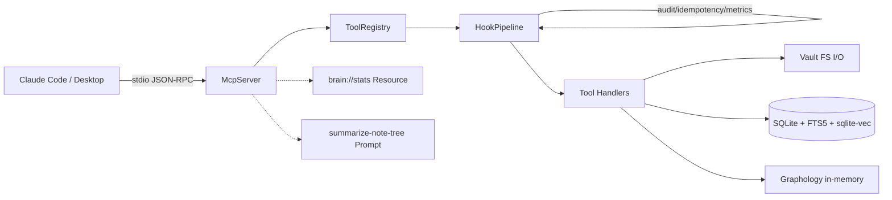
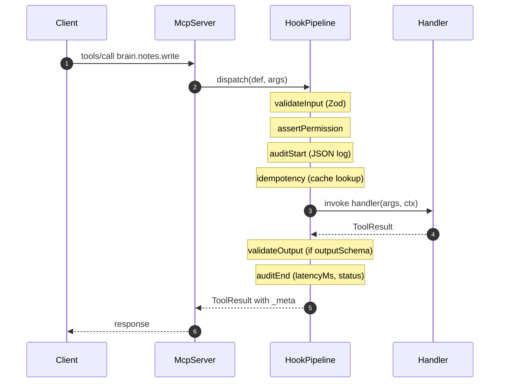

# astin-brain

A custom MCP server that exposes a personal Obsidian vault to LLMs via the
[Model Context Protocol](https://modelcontextprotocol.io). It provides hybrid
search (BM25 + vector), wikilink graph traversal, and CRUD over a local
markdown vault — all running in-process with zero external API calls.

> Version 1.1.0 · 24 tools (12 namespaced + 12 deprecated aliases) · 1 Resource · 1 Prompt
> Node + TypeScript · SQLite (FTS5 + sqlite-vec) · Graphology · all-MiniLM-L6-v2

---

## TL;DR

```bash
# install + build
cd .mcp-server
npm install
npm run build

# index the vault (downloads a 22MB embeddings model on first run)
npm run reindex

# wire it into Claude Code (~/.mcp.json) or Claude Desktop config
# then talk to it: "search my second brain for ATS file upload tricks"
```

24 tools, 1 read-only Resource, 1 reusable Prompt template. All 3 MCP
primitives are exposed — see [`server.ts`](./src/server.ts).

---

## Why this project exists

LLMs are stateless. Personal knowledge is not. Connecting them with a
search-and-graph layer turns a vault of ~120 markdown notes into a
queryable second brain. Every claim in this README is backed by code
in this repo and tests that exercise it.

---

## Architecture



### Three-layer hex architecture

| Layer | Files | Responsibility |
|---|---|---|
| **Transport** | `src/index.ts` | stdio JSON-RPC, lifecycle, graceful shutdown |
| **Registry + Pipeline** | `src/registry/*` | tool registration, hooks, permissions, errors, idempotency |
| **Tool handlers** | `src/tools/*` | thin handlers that call core services |
| **Core** | `src/core/*` | Vault, DB, Graph, Indexer, Embedder, Security |

The transport never talks to handlers directly — every call flows through
the **HookPipeline**, which is composable Express-style middleware.

---

## Tool lifecycle



7 hooks run on every call, in order:

1. **validateInput** — Zod parse → `ToolError("VALIDATION")` on failure
2. **assertPermission** — checks tool permission against `BRAIN_PERMISSION_MODE` env
3. **auditStart** — structured JSON log with requestId + tool + version
4. **idempotency** — if tool is `idempotent` and `idempotencyKey` was supplied, short-circuits duplicate calls within 5min
5. **metrics** — wraps execution with a timer, records p50/p95/p99 per tool
6. **errorWrap** — anything that escapes the handler becomes a `ToolError("INTERNAL")`
7. **auditEnd** — logs `latencyMs`, `status: ok|error`

See [`src/registry/pipeline.ts`](./src/registry/pipeline.ts).

---

## Adding a new tool (60 seconds)

The registry consumes pure data. Append a `ToolDefinition` to one of
`src/tools/{crud,search,graph}.ts` and rebuild — no other file changes:

```ts
// src/tools/search.ts
{
  name: "brain.search.recent",
  version: "1.0.0",
  description: "List the N most recently modified notes.",
  permission: "read",
  inputSchema: {
    limit: z.number().min(1).max(100).default(10),
  },
  handler: async ({ limit }) => {
    const rows = db.getRecentNotes(limit);
    return {
      content: [{ type: "text", text: JSON.stringify(rows, null, 2) }],
    };
  },
}
```

The registry picks it up at boot via `registry.attachTo(server, pipeline)`,
which loops once over all definitions and wires each to the MCP server with
annotations (`readOnlyHint`, `destructiveHint`, `idempotentHint`) and `_meta`
(version, permission, deprecated).

---

## Versioning & deprecation

Every tool has an explicit `version` (semver) and an optional `deprecated`
metadata block:

```ts
deprecated: {
  since: "1.1.0",
  replacement: "brain.notes.read",
  sunset: "2026-09-01"
}
```

When set, the tool's description is auto-prefixed `[DEPRECATED since 1.1.0, use brain.notes.read]`
and every response carries `_meta.deprecated`, so clients can warn users.

This server keeps **12 legacy snake_case names** (`read_note`, `hybrid_search`,
`graph_neighbors`, ...) as deprecated aliases that delegate to the new
namespaced names (`brain.notes.read`, `brain.search.hybrid`, ...).
See [`src/tools/deprecated.ts`](./src/tools/deprecated.ts).

---

## The 3 MCP primitives

| Primitive | Example here | When to use |
|---|---|---|
| **Tools** | `brain.notes.write`, `brain.search.hybrid` | Side-effectful or parameterized actions |
| **Resources** | `brain://stats` | Read-only URI-addressable context (clients can subscribe) |
| **Prompts** | `summarize-note-tree` | Reusable templates a user can trigger via slash-command |

`brain://stats` returns live vault counts + per-tool p50/p95/p99 latencies —
no extra logging stack needed for basic observability. See
[`src/resources/vault-stats.ts`](./src/resources/vault-stats.ts).

---

## Observability

- **Structured JSON logs** to stderr (stdout is reserved for MCP transport — never log to stdout in this process).
- Per call, two log lines: `tool.start` and `tool.end` with `requestId`, `tool`, `version`, `latencyMs`, `status`.
- Error path emits `tool.error` with `code` (`VALIDATION` | `PERMISSION_DENIED` | `NOT_FOUND` | `CONFLICT` | `INTERNAL`).
- **In-memory metrics** (`ToolMetrics`) — ring buffer of last 1k samples per tool. Surfaced via the `brain://stats` Resource.
- For multi-instance production: swap the in-memory `ToolMetrics` for OpenTelemetry / Prometheus. The interface stays the same.

```bash
# tail the live JSON log stream
node build/index.js 2>&1 1>/dev/null | jq -c '.'
```

---

## Idempotency & concurrency

Write tools (`brain.notes.write`, `brain.notes.update`, `brain.notes.delete`)
accept an optional `idempotencyKey` (typically a UUID v4):

- Same `(tool, key)` within **5 minutes** returns the original cached result.
- The handler does **not** re-execute. Network retries are safe.
- Only successful results are cached — failures may be retried.

`brain.notes.update` additionally supports **optimistic concurrency** via
`ifModifiedSince`. If the file's mtime on disk is newer than the value the
client provided, the call fails with `ToolError("CONFLICT")` instead of
silently overwriting.

```ts
// First call writes the note and caches the result.
brain.notes.write({ path, title, content, idempotencyKey: "uuid-1" })

// Retry within 5 min: instant, no side effects, _meta.idempotencyHit = true.
brain.notes.write({ path, title, content, idempotencyKey: "uuid-1" })
```

In a multi-instance deployment you'd back the cache with Redis (`SETNX` +
`EXPIRE`). The interface in `src/registry/idempotency.ts` doesn't change.

---

## Permission scoping

Every tool declares its permission level: `read`, `write`, or `destructive`.

A boundary check runs in the pipeline against the env var
`BRAIN_PERMISSION_MODE`:

| Mode | Allowed |
|---|---|
| `all` (default) | read + write + destructive |
| `no-destructive` | read + write |
| `read-only` | read only |

```bash
BRAIN_PERMISSION_MODE=read-only node build/index.js
# brain.notes.delete now returns:
# { "error": "Tool requires 'destructive' but server is in 'read-only' mode",
#   "code": "PERMISSION_DENIED" }
```

This is the auth pattern for a local-only server. A networked server would
add a bearer-token check in the same hook (`permissionHook`) — one line.

---

## Security

All five guards live in [`src/core/security.ts`](./src/core/security.ts):

- **Path traversal** — `validatePath()` resolves the requested path, follows symlinks, and asserts the realpath stays inside either the vault root or an authorized symlink target under `Projects/`.
- **Extension whitelist** — `.md`, `.markdown`, `.txt`, `.canvas` only.
- **Frontmatter sanitization** — drops `__proto__`, `constructor`, `prototype`, `toString`, `valueOf` keys plus any function values; prevents prototype pollution from malicious YAML.
- **No outbound network** — embeddings run locally via `@huggingface/transformers`. No API keys required.
- **No stdout writes outside the transport** — every log line goes to stderr so it can't corrupt the JSON-RPC stream.

---

## Testing

```bash
npm test            # vitest run — 23 tests in ~600ms
npm run test:watch  # vitest watch mode
npm run test:coverage
```

Test layout:

```
tests/
├── unit/                  # pure functions
│   ├── security.test.ts        path traversal, extension, frontmatter sanitize
│   ├── registry.test.ts        duplicate detection, list()
│   ├── pipeline.test.ts        hook order, error short-circuit, permission
│   └── idempotency.test.ts     cache hit + isolation
├── integration/
│   └── tool-dispatch.test.ts   registry + pipeline end-to-end (CRUD via temp vault)
└── e2e/
    └── smoke.test.ts           spawn build/index.js, send MCP messages over stdio,
                                assert tools/list, resources/list, prompts/list
```

Vitest runs with `--pool=forks` because `better-sqlite3` native bindings
don't play well with worker threads.

---

## Operations

```bash
# Reindex the vault (compares fs mtime vs SQLite indexed_at)
npm run reindex

# Inspect tool list via raw stdio
(echo '{"jsonrpc":"2.0","id":1,"method":"initialize","params":{"protocolVersion":"2024-11-05","capabilities":{},"clientInfo":{"name":"x","version":"1"}}}'; echo '{"jsonrpc":"2.0","method":"notifications/initialized"}'; echo '{"jsonrpc":"2.0","id":2,"method":"tools/list"}'; sleep 1) | node build/index.js
```

**Signals & lifecycle:**
- `SIGTERM` / `SIGINT` → close transport → close SQLite (idempotent guard) → `process.exit(0)`
- `mcpServer.server.onclose` (client disconnects) → close SQLite
- `uncaughtException` / `unhandledRejection` → log + exit(1)

**Env vars:**
| Name | Default | Purpose |
|---|---|---|
| `VAULT_PATH` | `~/SecondBrain` | Root of the vault to index |
| `BRAIN_PERMISSION_MODE` | `all` | `read-only`, `no-destructive`, or `all` |
| `BRAIN_LOG_LEVEL` | `info` | `debug`, `info`, `warn`, `error` |

---

## Stack & design rationale

| Component | Choice | Why |
|---|---|---|
| MCP SDK | `@modelcontextprotocol/sdk` v1.29+ | Standard protocol, first-party support in Claude Code & Desktop |
| Database | SQLite (better-sqlite3) | One file, no server, WAL mode, synchronous API |
| Full-text | SQLite FTS5 (porter unicode61) | Built-in BM25, multilingual stemming |
| Vector | sqlite-vec v0.1.6 | Lives in the same DB file; KNN in <10ms for 10k notes |
| Embeddings | `Xenova/all-MiniLM-L6-v2` (22MB) | Local CPU-only, 384-dim, multilingual (ES + EN) |
| Graph | graphology (in-process) | Microsecond BFS for <10k notes; no extra service |
| Frontmatter | gray-matter | YAML with safety; we sanitize on top |
| Schema validation | Zod | Type-level + runtime; integrates with MCP SDK |

For a deeper trade-off discussion and a "what I'd change for production"
section, see [ARCHITECTURE.md](./ARCHITECTURE.md).
